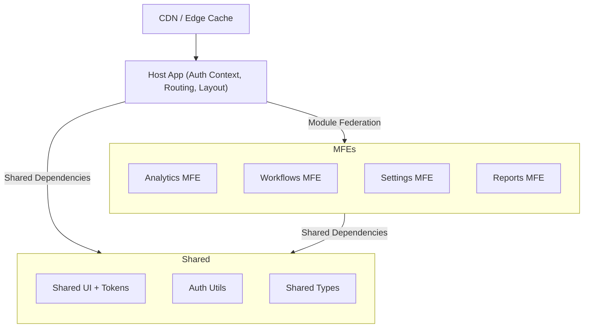

# Architecture Overview

The dashboard is composed by a single Host application that loads four domain
Micro-Frontends (MFEs) at runtime. The Host provides the shell experience
(routing, auth context, and shared layout), while each MFE owns a
domain slice (analytics, workflows, settings, reports). The approach favors
independent team delivery with controlled shared contracts and a consistent UX.

## High-Level Diagram



## Composition Approach

Client-side composition using Module Federation. The Host loads MFEs at runtime
from their `remoteEntry.js`, enabling independent deploys with a single URL
experience. This avoids iframe drawbacks (UX inconsistency, SEO limits) while
keeping build-time coupling minimal. Next.js can be introduced for host
server/edge rendering if SEO or first-paint latency becomes a priority, without
changing the MFE contract. But since this is a dashboard, we don't need to worry about SEO.

## Routing and Navigation

- Host owns top-level routes and the global navigation.
- Each MFE owns its internal routes under a stable base path.
- Deep links are supported via a single URL space (example: `/analytics/*`).
- Host router maps paths to remote `./Module` exports and wraps with auth.

Entry points:

- Host router and layout: `apps/host/src/app/app.tsx`
- Host bootstrap: `apps/host/src/bootstrap.tsx`

## Design System Sharing and Drift Control

- Shared UI components and design tokens live in `libs/shared-ui` and are versioned.
- MFEs consume tokens via CSS variables and components via a published package.
- Theming: Host sets theme tokens at the root; MFEs inherit via CSS variables.

## Auth Integration

- Host owns the session and provides an Auth context to MFEs.
- Token flow: Host exchanges credentials for access + refresh tokens, stores
  tokens in httpOnly cookies and a short-lived in-memory access token cache (Demo purposes only, in production we would use cookies).
- MFEs read auth state from context and call a shared auth client for refresh.
- Route protection: Host enforces `RequireAuth` for protected routes.

## Team Independence (Build/Test/Deploy)

- Each MFE builds and deploys as its own artifact with its own pipeline.
- Host deploys independently and reads a versioned MFE manifest at runtime.
- MFEs can ship without Host changes unless the contract changes.
- Shared libraries follow a published, versioned release process.

## Operational Details (Bulleted)

- Shared dependencies: Module Federation shares React/React-DOM as singletons
  with strict version ranges to avoid duplicate bundles.
- CSS isolation: BEM-style naming + CSS Modules in MFEs; global tokens only in
  `libs/shared-ui` to minimize collisions.
- Integration testing: contract tests for shared APIs; E2E smoke flows against
  a staging manifest combining the latest MFE builds.
- Deployment model: each MFE ships to its own CDN path; Host deploy updates its
  MFE manifest or uses a manifest service with cache-busting.
- Security: httpOnly cookies for refresh tokens, scoped cookies per domain,
  strict CORS on auth endpoints, CSP with allowlisted MFE origins.

## Snippets and Examples

Sample manifest (runtime discovery):

```json
{
  "analytics": "https://cdn.example.com/mfe/analytics/1.8.2/remoteEntry.js",
  "workflows": "https://cdn.example.com/mfe/workflows/2.3.0/remoteEntry.js",
  "settings": "https://cdn.example.com/mfe/settings/1.4.5/remoteEntry.js",
  "reports": "https://cdn.example.com/mfe/reports/0.9.1/remoteEntry.js"
}
```

Shared component versioning (example):

```ts
// v2.1.0: Button adds intent, deprecates variant
type ButtonPropsV2 = {
  intent?: 'primary' | 'secondary' | 'danger';
  variant?: 'solid' | 'outline'; // Deprecated. Use intent + appearance.
  appearance?: 'solid' | 'outline';
};
```

## Concrete Repo Topology

- Host application: `apps/host`
- Remote applications: `apps/analytics`, `apps/workflows`, `apps/settings`,
  `apps/reports`
- Shared libraries:
  - `libs/shared-ui`: design system components and tokens
  - `libs/auth-utils`: auth context and route protection
  - `libs/shared-types`: shared TypeScript types

## Build and Dev Workflow

Nx orchestrates builds, tests, and linting across the workspace. Rspack handles
bundling and dev servers. Module Federation wiring is handled by Nx plugins.

Dev server ports:

- Host: 4200
- Workflows: 4201
- Analytics: 4202
- Settings: 4203
- Reports: 4204

Module Federation config:

- Host remotes: `apps/host/module-federation.config.ts`
- Remote exposes: `apps/*/module-federation.config.ts`

Rspack config:

- Host: `apps/host/rspack.config.ts`
- Host prod overrides: `apps/host/rspack.config.prod.ts`
- Remotes: `apps/*/rspack.config.ts`
